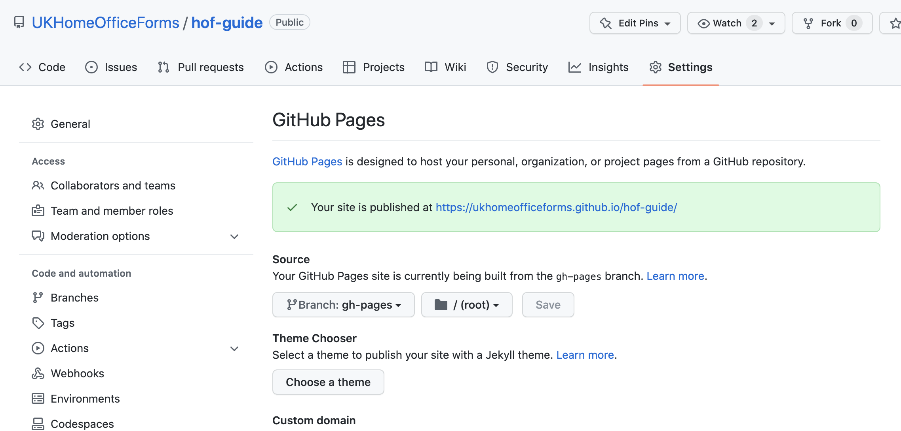

# Home Office Forms Guide

This is a GovUK styled wiki built using [React](https://reactjs.org/) and [Gatsby](https://www.gatsbyjs.com/) to quickly build and setup a static website using Github Actions & Pages for a streamlined way of committing and accessing documentation for a development team.

A new project can use setup their own wiki using this repo within 5 easy steps (see 'Repo Setup' below).

GovUK styles and JS taken from static assets generated by the [X-GovUK Eleventy Plugin](https://x-govuk.github.io/govuk-eleventy-plugin/get-started/)

## 🚀 Quick start

### Repo Setup

1.  Fork/clone this repo and stick it into the relevant repo space on Github.
2.  Add a repository secret called 'DOCS_ACCESS_TOKEN' which has basic read/write access to the repo. If you are unsure on how to set this up, then refer to Github's docs on [How To Setup a Personal Access Token](https://docs.github.com/en/authentication/keeping-your-account-and-data-secure/creating-a-personal-access-token). Once setup, go to your repo's 'Settings' and add the secret under the left hand side Settings navigation bar under 'Security -> Secrets -> Actions'.

    **Security Actions Settings**

    

    **Repository Secret Example**

    

3.  Add a remote branch for your repo to be used for Github Pages. The default standard for this branch name is 'gh-pages' although you can name it anything you want it to be. Run the following commands locally to set it up:

    ```shell
    git checkout -b gh-pages
    git push origin gh-pages:gh-pages
    ```

4.  Go to 'Code and automation -> Pages' under the repo's 'Settings', you should get a confirmation of the site address your static site will be deployed to. You can change which branch you want your site to build off if not 'gh-pages'

    **Github Pages Settings**

    

    **Default Configuration Setup for Github Page**

    

5.  Lastly, make your first push to master branch and this should trigger a build process. You can follow this under 'Actions' in the top navigation bar of the repo. Within a few minutes your static site should be available. That's it! You are all setup!

    **Github Actions**

    

### Local Development

1.  **Installing the Wiki**

    Start this site by ensuring at least [Node 16.15.0](https://nodejs.org/en/blog/release/v16.15.0/) is installed. You can do this using [Node Version Manager (NVM)](https://tecadmin.net/install-nvm-macos-with-homebrew/) and following the following instructions:
    ```shell
    # Use Node Version Manager to install Node v16.15.0 (latest LTS version)
    nvm install 16.15.0
    # Then use Node v16.15.0 before installing project dependencies
    nvm use 16.15.0
    # If yarn is not installed run the following to globally install it
    npm i yarn -g
    # Install project dependencies
    yarn
    ```

2.  **Run the Service**

    Run the following to start up the service on [Localhost](http://localhost:8080)
    ```shell
    yarn run develop
    ```
    Any updates will either automatically update the page or require a manual page reload.

### Deploying

1.  **Automated**

    Push or merge changes to master branch. These will trigger Git Actions that update and auto-deploy to a `gh-pages` branch. This in turn will deploy the static site to the relevant Github page link.

2.  **Manual**

    Alternatively you can run the following which is the manual approach to step 1 above.
    ```shell
    yarn run deploy
    ```

### Troubleshooting
There have been instances when upon a fresh local installation, the following error appears when running `yarn run develop`:
```shell
error Command failed with signal "SIGSEGV".
info Visit https://yarnpkg.com/en/docs/cli/run for documentation about this command
```
It is unknown why this happens. It could be another process is running on the same port. This can be changed by going into the 'package.json' file, and under the 'develop' script change the port (Default: '-p 8000') to a different port number. Otherwise re-running `yarn run develop` usually makes the error disappear.
