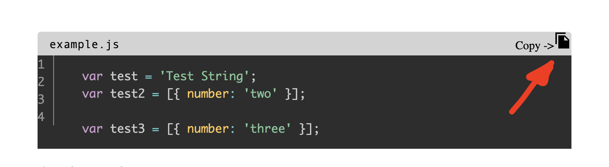
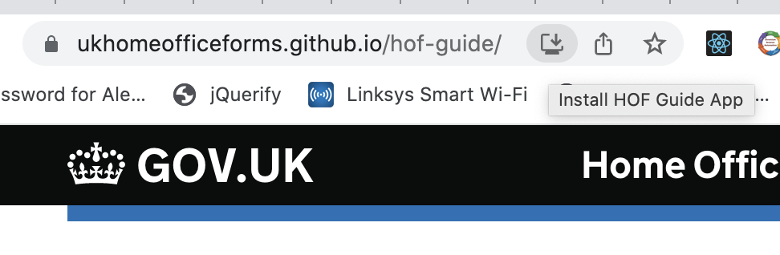

```toc
```

## Table of Contents
Add the following at the top of your content to navigate to headers using anchors easily. This will then appear like the table of contents above this.
````
```toc
```
````

## Code Blocks
You can add code blocks like this specifying the language (in this case 'js' for Javascript) and a 'title' which names the code block and can refer to a file name.

### How to setup code block
````
```js:title=example.js
var test = 'Test String';
var test2 = [{ number: 'two' }];

var test3 = [{ number: 'three' }];
```
````
\
This then appear like this in the markdown:
```js:title=example.js
var test = 'Test String';
var test2 = [{ number: 'two' }];

var test3 = [{ number: 'three' }];
```
### How to copy/reuse code block
You can also copy code in code blocks by clicking this symbol to reuse it in whichever application you'd like to paste it into:


## Adding Inline Images

### How to setup
Here is an example of adding an inline image:
```md:title=how-to-add-image

```
\
This is what this looks like in reality:


### How to reference
All images should ideally live in the 'static' directory. This is bundled so that the main index.js file for the homepage of the site can access relevant images outside of the markdown. It may be images can be accessed from any project folder as the plugin `gatsby-remark-images` is used to reference them. But this has not been tested so there could be unexpected behaviour.
