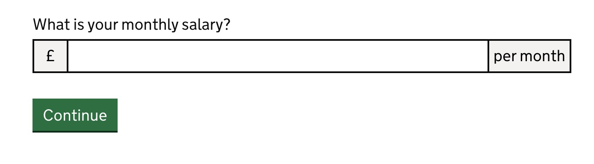
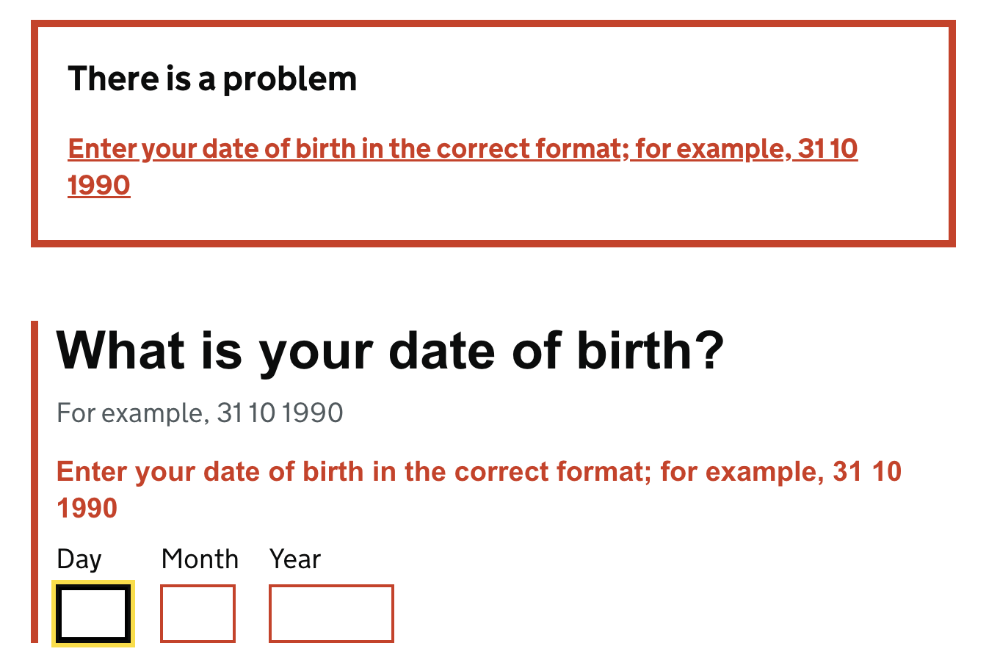

This is a basic documentation page to illustrate changes. At time of writing, it is recommended to compare a repository
without a non-gov implementation in HOF.In future this will not be necessary. In order to update your project 
you will require access to these following urls for documentation/guidance provided.


<br>

```toc
# This code block gets replaced with the Table Of Contents
```

## Useful links
- [Gov UK Design System and Documentation](https://design-system.service.gov.uk)
- [Github - Sulthans' Implementation for UKVIET](https://github.com/UKHomeOffice/end-tenancy/pull/201)


## Package.json updates

- Specify package to use `hof@20.0.0-beta.29`
- Remove `govuk-frontend` in package.json
- Run `yarn upgrade moment@^` - Time of writing it should prefer `^2.29.4`. This will fix a synk issue
- Change the engine to support multiple versions of node

```js:title=engine-block.js
  "engines": {
    "node": ">=14.15.0"
  },
```
- Make dev use the .env file (command varies on projects)
```js:title=basic-dev-cmd.js
"dev": "NODE_ENV=development hof-build watch --env"
```
## Remove govuk-frontend styles 

- Remove `@import "govuk-frontend/all.scss"` in app.scss

## Run the application and start comparing 

Note down any broken pages/not similar then refer to the govuk documentation to specify the correct classnames. After 
finishing run your `acceptance tests` to fix any classnames.

```text
 Use chromes "Copy selector" functionality to update acceptance tests faster
``` 

## Examples
### Changes on NRM
#### Custom Start page

If the start page does not fully take up the page and navigation links are too close the `two-thirds` class then use
use this function

```js:title=index.js
if (window.location.pathname === '/start' || window.location.pathname === '/paper-version-download') {
  $('.govuk-grid-column-two-thirds')
    .eq(1)
    .addClass('govuk-grid-column-full')
    .removeClass('govuk-grid-column-two-thirds');
}
```

#### Toggling using checkbox-group for textarea

For example for custom pages that requires toggling a textarea through a checkbox-group 

```html:title=fields.js
  'types-of-exploitation-other': {
    mixin: 'checkbox-group',
    legend: {
      className: 'visuallyhidden'
    },
    options: [{
      value: 'other',
      toggle: 'other-exploitation-details',
      child: 'textarea'
    }]
  },
  'other-exploitation-details': {
    mixin: 'textarea',
    validate: ['required', {type: 'maxlength', arguments: [15000]}],
    legend: {
      className: 'visuallyhidden'
    },
    className: 'govuk-textarea',
    attributes: [
      {
        attribute: 'rows',
        value: 4
      }
    ],
    dependent: {
      value: 'true',
      field: 'types-of-exploitation-other'
    }
  },
```

with the partial

```html:title=Partial.html
<div id="other-exploitation-fieldset" class="govuk-checkboxes__conditional govuk-checkboxes__conditional--hidden">
    {{#renderField}}other-exploitation-details{{/renderField}}
</div>
```

#### Toggling using Radio-box

```js:title=field.js
'does-pv-have-children': {
    mixin: 'radio-group',
    validate: ['required'],
    legend: {
      className: 'visuallyhidden'
    },
    options: [{
      value: 'yes',
      toggle: 'does-pv-have-children-yes-input',
      child: 'partials/does-pv-have-children-yes-amount'
    }, {
      value: 'no'
    }]
  },
```

with partial

```html:partial.html
<div id="does-pv-have-children-yes-input" class="govuk-radios__conditional govuk-radios__conditional--hidden">
    {{#renderField}}does-pv-have-children-yes-amount{{/renderField}}
</div>
```


### Page headings and warnings with Checkboxes and Radio buttons(Single Page Questions)
 Page headings are included in the fieldset for single page questions with checkboxes and radio buttons using `isPageHeading`. To place warning text between the heading and a checkbox/radio button form on such pages, use `isWarning`.

 ```js:title=fields > index.js
 'choose-a-journey': {
    isPageHeading: true,
    isWarning: true,
    mixin: 'radio-group',
    validate: 'required',
    options: [
      'museums',
      'new-dealer',
      'shooting-clubs',
      'supporting-documents'
    ]
  },
 ```
 `isWarning` can be configured in field/index.js as above. It can also be configured in a behaviour:

 ```js:title=behaviour.js
 module.exports =
  superclass => class extends superclass {
    configure(req, next) {
      if (req.sessionModel.get('activity') === 'renew') {
        Object.keys(req.form.options.fields).forEach(key => {
          req.form.options.fields[key].isWarning = true
        });
      }
      next()
    }
  }
 ```

 ### Adding warning text using a page template

 Warning text can be added on a page using the html partial warn.html. It needs to be placed in the html template and a `warning` key in pages.json; the partial needs to be placed in the page that requires the warning text. Below is an example of it being used in the ASC form with the html partial.

 ```json:pages.json
 "declaration": {
    "header": "Declaration",
    "paragraph-1": "By continuing you confirm that:",
    "paragraph-2":  "- the information you've given is correct",
    "warning": "You could be prosecuted if you deliberately give untrue or misleading information."
  }
 ```

 ```html:title=declaration.html
 {{<partials-page}}
{{$page-content}}

<div>
  <p>{{#t}}pages.declaration.paragraph-1{{/t}}</p>
  <ul>
    <li>{{#t}}pages.declaration.paragraph-2{{/t}}</li>
  </ul>
  <br/>

  {{> partials-warn}}


  {{#fields}}
    {{#renderField}}{{/renderField}}
  {{/fields}}

  {{#input-submit}}next{{/input-submit}}
</div>
{{/page-content}}
{{/partials-page}}

 ```

 ```html:title=warn.html
<div class="govuk-warning-text">
    <span class="govuk-warning-text__icon" aria-hidden="true">!</span>
    <strong class="govuk-warning-text__text">
    <span class="govuk-warning-text__assistive">Warning</span>
        {{warning}}
    </strong>
</div>
 ``` 

  ### Adding prefixes and suffixes to an input field in hof

  Inside hof, the `isPrefixOrSuffix` key is defined which returns `true` if there is a prefix or a suffix as shown below.
  
  ```js:title=frontend/template-mixins/mixins/template-mixins.js
  function inputText(key, extension) {
    const field = Object.assign({}, this.options.fields[key] || options.fields[key]);
    ...
    return Object.assign({}, extension, {
      ...
      attributes: field.attributes,
      isPrefixOrSuffix: _.map(field.attributes, item => {if (item.prefix || item.suffix !== undefined) return true;}),
    });
  }
   ```
   This key is used in template-mixins/partials/forms/input-text-group.html which if `true` wraps the input field with `<div class="govuk-input__wrapper">` as shown below. 

   ```html:title=frontend/template-mixins/partials/forms/input-text-group.html
       {{#isPrefixOrSuffix}}<div class="govuk-input__wrapper">{{/isPrefixOrSuffix}}
        {{#attributes}}
            {{#prefix}}
                <div class="govuk-input__prefix" aria-hidden="true">{{prefix}}</div>
            {{/prefix}}
        {{/attributes}}
        <input
        ...
        >
        {{#attributes}}
            {{#suffix}}
                <div class="govuk-input__suffix" aria-hidden="true">{{suffix}}</div>
            {{/suffix}}
        {{/attributes}}
    {{#isPrefixOrSuffix}}</div>{{/isPrefixOrSuffix}}
   ```
   
  Fields that do not contain a prefix or suffix should not exist inside `<div class="govuk-input__wrapper">` according to the latest design system service update. An input field can contain a prefix and a suffix which is displayed below in an example from the sandbox app.

#### How to add prefixes and suffixes to a field within a service

```js:title=fields.js
  income: {
    attributes: [{prefix: '£', suffix: 'per month'}],
  }
```

  

### Clickable validation summary for input-date mixins

When there is an error, if the `field.mixin` is an `input-date` The string `'-day'` is suffixed onto the `key`, which here refers to the field. This is assigned to the `errorLinkId` property which is what allows the validation error summary to link to the field which has the error.

```js:title=controller/controller.js
  _getErrors(req, res, callback) {
    super._getErrors(req, res, () => {
      Object.keys(req.form.errors).forEach(key => {
        if (req.form && req.form.options && req.form.options.fields) {
          const field = req.form.options.fields[key];
          ...
          // get first field for date input control
          else if (field && field.mixin === 'input-date') {
            req.form.errors[key].errorLinkId = key + '-day';
          } else {
            req.form.errors[key].errorLinkId = key;
          }
        }
        ...
      });
      callback();
    });
  }
```

The validation error summary will now be a clickable link which will take the user to the first field if there is an error. This follows the latest govuk design system guidelines except where the date entered cannot be correct (e.g. '13’ in the month field cannot be correct.) and where the date is incomplete (e.g. day, month or year field where the information is missing or incomplete.)  In those two cases the guidelines recommend that the individual field should be highlighted but since hof uses moment js' validator which returns the whole date field as incorrect, our current configuration follows the guidelines.

#### Adding input-date mixin to a field within a service

As shown below in the sandbox application `mixin: 'input-date'` has been added to a date field in fields.js. 

```js:title=fields.js

  'dateOfBirth': dateComponent('dateOfBirth', {
    mixin: 'input-date',
    isPageHeading: 'true',
    validate: [
      'required',
      'date',
      { type: 'after', arguments: ['1900'] }
    ]
  })
```


